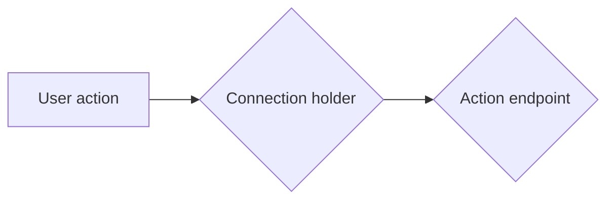

# wallet-dev
An dev resolution for wc based punkos wallet

### Architecture

### Dependencies

### Local Development

### Remote Deployment

### Todo List

- [ ] This is a todo item.
- [x] This is done work item.

### License